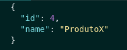

<h1>Store Manager</h1>

  Store manager is a CRUD API. It is built using NodeJS, Express and MySQL. MSC architecture (Models, Services, 
  Controllers) was applied in this project.The application was tested using Mocha, chai and sinon.
  
  The project was developed in a docker environment.

  The user is able to Create, Read, Update and Delete products and sales records.

<h2> Built With </h2>

 
 - NodeJS 

 
- Express 

 
 - MySQL 

 
 - Docker 
 
 
 - Mocha 

 
 - Chai 

 
 - Sinon 

 
 - Conventional commits (extension) 

<h2>Endpoints<h2/>

<h3> Products: </h3>

<h3> - GET  </h3>
 
<strong> /products </strong>

 Get all products 

<strong> Parameters: No parameters </strong>   

<strong> Response: </strong>

 Status: 200 

 
 
 
 
 

<strong> /products/:id </strong>

 Get product by id 

<strong> Parameters: No parameters </strong>   

<strong> Response: </strong>

 Status: 200 

 

 Status: 404 

 - { message: "Product not found" }

 
 
 
 
 

<strong> /products/search </strong>

 Get product by search term 

<strong> Parameters: No parameters </strong>   

<strong> Response: </strong>

 Status: 200 

 If not found any product with the search term return all products 

 
 
 

<h3> - POST  </h3>

<strong> /products </strong>

 Create a new product 

<strong> Parameters:</strong>

 -body 

<strong> Response: </strong>

 Status: 201 

 Status: 400 

 - { message: "name is required" }

 Status: 422 

 - { message: "name length must be at least 5 characters long" }

 
 
 

<h3> - PUT  </h3>

<strong> /products/:id </strong>

 Update a product by id 

<strong> Parameters:</strong>

 -body 

<strong> Response: </strong>

 Status: 200 

 Status: 400 

 - { message: "name is required" }

 Status: 404 

 - { message: "Product not found" }

 Status: 422 

 - { message: "name length must be at least 5 characters long" }

 
 
 

<h3> - DELETE  </h3>

<strong> /products/:id </strong>

 Delete a product by id 

<strong> Parameters: No parameters </strong>   

<strong> Response: </strong>

 Status: 204 

 - Nothing 

 

 Status: 404 

 - { message: "Product not found" }

   

<h3> Sales: </h3>

<h3> - GET  </h3>
 
<strong> /sales </strong>

 Get all sales 

<strong> Parameters: No parameters </strong>   

<strong> Response: </strong>

 Status: 200 

 
 
 
 
 

<strong> /sales/:id </strong>

 Get sale by id 

<strong> Parameters: No parameters </strong>   

<strong> Response: </strong>

 Status: 200 

 

 Status: 404 

 - { message: "Sale not found" }

 
 

<h3> - POST  </h3>

<strong> /sales </strong>

 Create a new sale 

<strong> Parameters:</strong>  

 - body 

<strong> Response: </strong>

 Status: 201 

 Status: 400 

 - { message: "productId is required" }

 - { message: "quantity is required" }

 Status: 422 

 - { message: "quantity must be greater than or equal to 1" }

 Status: 404 

 - { message: "Product not found" }

 
 
 

<h3> - PUT  </h3>

<strong> /sales </strong>

 Update a sale by id 

<strong> Parameters:</strong>  

 - body 

<strong> Response: </strong>

 Status: 200 

 Status: 400 

 - { message: "productId is required" }

 - { message: "quantity is required" }

 Status: 422 </

 - { message: "quantity must be greater than or equal to 1" }

 Status: 404 

 - { message: "Product not found" }

 
 
 

<h3> - DELETE  </h3>

<strong> /sales/:id </strong>

 Delete a sale by id 

<strong> Parameters: No parameters </strong>   

<strong> Response: </strong>

 Status: 204 

 - Nothing 

 

 Status: 404 

 - { message: "Sale not found" }

 
 
 

<h2>
  How try the application?
</h2>

  Using docker (version 1.29 > is required):   
   1. First run in your terminal <code>docker-compose up -d</code> to up containers.  
   2. Then use the command <code>docker exec -it store_manager bash</code> to acess the container terminal.  
   3. After it use  <code>npm install</code> to install all dependences.  
   4. Run <code>npm start</code> on container terminal to start the application. 
   5. If you don´t have any client extension to do the requestions download <code>Thunder Client</code> extension on VS Code. 
   6. Select the method on thunder client. 
   7. Do requisitions on thunder client using the URL shape http://localhost:3000/endpoint.

  Make sure that all containers are up and the ports 3000 and 3006 of your computer are available

 

<h2>
  How run tests?
</h2>

   1. First run in your terminal <code>docker-compose up -d</code> to up containers.  
   2. Then use the command <code>docker exec -it store_manager bash</code> to acess the container terminal.  
   3. Run <code>npm run test:mocha </code> on container terminal.
</p.

 
 
  

 Any questions or suggestions? Contact me 

